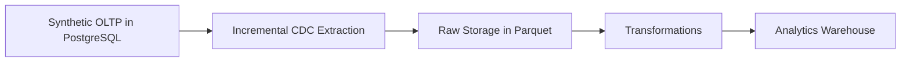

# oltp-warehouse

Data engineering project that simulates a fintech OLTP system, captures changes incrementally, and loads analytics-ready warehouse data.

## Current Status

This repository now includes the first source, extraction, and transformation slices.

- A package-based CLI can bootstrap a local PostgreSQL OLTP dataset.
- Docker Compose is included for a repeatable local PostgreSQL setup.
- Incremental CDC extraction writes parquet batches and tracks watermarks locally.
- A dbt project builds curated silver parquet models from the bronze CDC layer.
- Structured observability captures run metadata, step metrics, dbt artifacts, and failures locally.
- AWS deployment assets described below are still planned.

The README documents the intended direction so the project can evolve with a clear scope.

## Goal

Build a small but realistic end-to-end pipeline that:

- generates synthetic fintech operational data in PostgreSQL
- extracts changes incrementally
- stores raw snapshots or change batches in columnar files
- transforms the data into analytics-friendly warehouse tables
- stays cheap to run locally and in AWS

## Data Source

The primary data source for this project is a synthetic PostgreSQL OLTP database generated by the project itself.

Planned source domains include:

- accounts
- transactions
- transfers
- payments

Why synthetic data is the default:

- it avoids dependency on proprietary production data
- it keeps the project reproducible for local development and testing
- it allows controlled simulation of inserts, updates, deletes, retries, and late-arriving changes

This project is not currently designed around a public dataset. The source of truth is intended to be generated operational data with realistic transactional behavior.

## Target Architecture



Planned characteristics:

- mutable OLTP records with `created_at` and `updated_at`
- batch-oriented CDC using a watermark or equivalent state
- idempotent ingestion to avoid duplicates on retries
- warehouse-friendly outputs for downstream analytics

## AWS Deployment With Minimal Cost

The preferred AWS deployment path is a serverless batch design that minimizes idle cost:

- `Amazon EventBridge` triggers scheduled runs
- `AWS Lambda` runs lightweight ingestion and transformation jobs
- `Amazon S3` stores raw extracts, transformed parquet files, and small warehouse artifacts
- `Amazon CloudWatch Logs` captures execution logs

This is the default recommendation because it avoids paying for always-on compute.

### Suggested low-cost flow

1. EventBridge runs the pipeline on a schedule.
2. Lambda connects to the OLTP source, reads incremental changes, and writes raw files to S3.
3. A second Lambda, or the same scheduled job, transforms the raw data into warehouse-ready outputs.
4. Analysts or downstream jobs read the curated data directly from S3, or from a lightweight warehouse layer built on top of those files.

### Cost posture

- Prefer serverless services over always-on EC2 instances.
- Keep jobs short, batch-based, and small enough to fit Lambda runtime and memory limits.
- Use S3 as the default storage layer because it is cheap, durable, and simple.
- Start with a schedule-based pipeline instead of orchestrators or containers.

### When to move beyond Lambda

Move to ECS/Fargate, EC2, or a fuller warehouse stack only if:

- transforms outgrow Lambda limits
- dependencies become too heavy for Lambda packaging
- runtime becomes long enough that containerized jobs are more practical
- concurrency or orchestration requirements become more complex

For an initial version, avoid RDS, long-running EC2, and other always-on services unless there is a clear requirement for them.

## Local Development

The repo now includes the local OLTP bootstrap generator and seed-data tooling.

### Requirements

- Python 3.13+

### Install

Using `uv`:

```bash
uv sync
```

Using `pip`:

```bash
pip install -e .
```

### Start PostgreSQL

Create a local env file first:

```bash
cp .env.example .env
```

Then start PostgreSQL:

```bash
docker compose up -d
```

The CLI reads connection settings from `.env` by default. The committed example file is:

```bash
OLTP_DB_HOST=localhost
OLTP_DB_PORT=5432
OLTP_DB_NAME=oltp_warehouse
OLTP_DB_USER=oltp
OLTP_DB_PASSWORD=oltp
```

### Bootstrap synthetic OLTP data

```bash
oltp-warehouse bootstrap
```

By default each command also writes structured run logs under:

```bash
data/observability/
```

### Extract CDC batches

The first CDC run performs a full snapshot for each table and creates the watermark state file:

```bash
oltp-warehouse extract-cdc
```

Default local paths:

```bash
data/raw/cdc/
data/state/cdc_state.json
```

Later runs use `updated_at` watermarks from `data/state/cdc_state.json` and only extract rows changed since the last successful run.

You can override the default observability location for any command:

```bash
oltp-warehouse extract-cdc --observability-dir tmp/observability
```

### Build silver warehouse models

The transformation layer uses `dbt` with the DuckDB adapter locally and writes curated silver outputs as parquet files:

```bash
oltp-warehouse transform
```

Equivalent direct dbt command:

```bash
DBT_PROFILES_DIR=. dbt run --project-dir . --select silver
```

Local paths used by the transformation layer:

```bash
data/raw/cdc/      # bronze parquet inputs
data/silver/       # curated silver parquet outputs
data/warehouse/    # local duckdb runtime file for dbt execution
```

The first warehouse slice stays at bronze-to-silver and creates:

- `silver_accounts`
- `silver_transactions`
- `silver_transfers`
- `silver_payments`

Each model casts fields explicitly and keeps the latest row per source primary key using `updated_at`.

### Why DuckDB sits between bronze and silver

DuckDB is not the business warehouse in this project. It is the local SQL execution engine that `dbt` uses to read bronze parquet files and produce silver parquet outputs.

The architectural role is:

- bronze and silver stay as parquet datasets, which keeps storage cheap, portable, and easy to inspect
- DuckDB provides the compute layer needed to run SQL transforms, casts, window functions, and deduplication logic over those files
- `dbt` provides model structure, dependency management, and tests on top of that execution engine

In practice the flow is:

```text
PostgreSQL OLTP -> CDC parquet bronze -> DuckDB executes dbt models -> silver parquet outputs
```

This follows a separation-of-storage-and-compute principle. Parquet files define the storage layout, while DuckDB handles query execution during transformation. That keeps local development lightweight and avoids introducing a heavier warehouse platform just to model and validate the first pipeline slice.

### Validate ingestion and transforms

Run the local validation gate after CDC extraction and transformation:

```bash
oltp-warehouse validate
```

This validation step:

- checks bronze CDC parquet directories, required columns, readable files, and watermark state
- checks silver parquet outputs and required columns
- runs `dbt test --select silver`

If you only want the local file-based checks and want to skip dbt tests:

```bash
oltp-warehouse validate --skip-dbt-tests
```

### Observability and logs

Each CLI command writes structured local observability artifacts by default:

```bash
data/observability/runs/      # append-only JSONL event streams per run
data/observability/latest/    # latest summary JSON per command
data/observability/artifacts/ # captured dbt stdout/stderr and related artifacts
```

The default event model includes:

- run start and completion timestamps
- command status and failure details
- step-level metrics such as row counts, file counts, and durations
- references to dbt stdout and stderr artifacts for `transform` and `validate`

dbt also writes its own native artifacts separately:

```bash
logs/dbt.log
target/
```

## Implementation TODO

- [x] Build the synthetic PostgreSQL OLTP generator.
- [x] Define the source schema for accounts, transactions, transfers, and payments.
- [x] Add seed or sample data generation for repeatable local runs.
- [x] Implement incremental CDC extraction with watermark tracking.
- [x] Write raw change batches to parquet with idempotent behavior.
- [x] Add warehouse transformations for analytics-ready tables.
- [x] Add local validation and test coverage for ingestion and transforms.
- [x] Add structured observability for pipeline runs, including run metadata, row counts, and failure reporting.
- [ ] Package the pipeline for low-cost AWS deployment with S3, Lambda, and EventBridge.
- [ ] Add a minimal deployed path that runs the pipeline on a schedule, writes to object storage, and captures logs.
- [ ] Document data contracts and schema evolution expectations for bronze and silver layers.
- [ ] Add a gold-layer analytics model or KPI-ready output on top of the silver warehouse tables.
- [ ] Expand the README with production tradeoffs, failure modes, and the rationale behind watermark-based CDC.

## Repository Layout

Current files:

```bash
.
├── .env.example
├── dbt/
│   └── models/
├── dbt_project.yml
├── docker-compose.yml
├── main.py
├── profiles.yml
├── pyproject.toml
├── README.md
├── src/
│   └── oltp_warehouse/
└── tests/
```

The repo will grow further as CDC, warehouse modeling, and deployment assets are added.

## Design Direction

### Why a synthetic OLTP source

Real transactional systems are rarely available for experimentation. A generated OLTP system makes it possible to test:

- updates and deletes
- status transitions
- backfills and replay safety
- late-arriving changes

### Why incremental CDC

Incremental ingestion keeps the project closer to real production data movement patterns than full reloads while staying simpler than log-based CDC in the first version.

### Why low-cost AWS first

The goal is to keep the project accessible. A serverless design makes it possible to experiment with cloud deployment while keeping ongoing cost near zero for small workloads.
